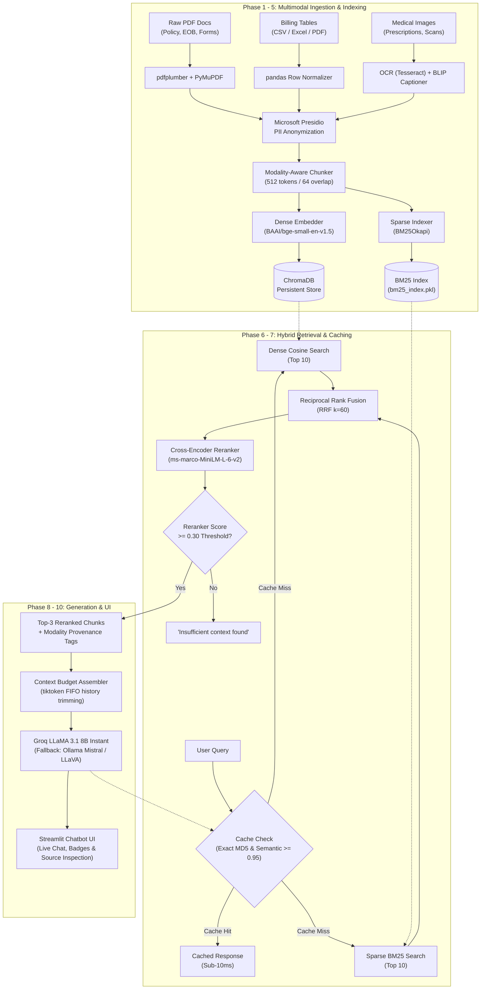

<div align="center">

# 🏥 Medical Insurance Claims Processing
### Enterprise Multimodal RAG Chatbot

[](https://www.python.org/)
[](https://streamlit.io/)
[](https://www.trychroma.com/)
[](https://groq.com/)
[](https://huggingface.co/)
[](https://github.com/explodinggradients/ragas)
[](https://microsoft.github.io/presidio/)
[](https://opensource.org/licenses/MIT)

<p align="center">
  <b>A state-of-the-art, fully free Multimodal Retrieval-Augmented Generation (RAG) assistant designed for medical claim adjudication, policy inquiries, prescription verification, and billing code reconciliation.</b>
</p>

[Key Features](#-key-features) •
[System Architecture](#-system-architecture) •
[Evaluation & Benchmarks](#-evaluation--benchmarks) •
[Quick Start](#-quick-start) •
[Docker Deployment](#-docker-deployment) •
[Repository Structure](#-repository-structure)

</div>

---

## 🌟 Key Features

| Capability | Technical Implementation | Highlights |
| :--- | :--- | :--- |
| **📑 Multimodal Ingestion** | `pdfplumber`, `PyMuPDF`, `pandas`, `pytesseract`, `BLIP` | Unifies unstructured PDFs, structured CSV tables, and handwritten/scanned prescriptions into standardized chunk representations. |
| **🛡️ HIPAA PII Masking** | Microsoft `presidio-analyzer` & `presidio-anonymizer` | Redacts patient names, SSNs, phone numbers, and dates before vector database storage. |
| **🎯 Hybrid Fusion Retrieval** | `BAAI/bge-small-en-v1.5` + `BM25Okapi` + RRF ($k=60$) | Blends dense semantic vector search with sparse keyword matching using Reciprocal Rank Fusion. |
| **🔬 Cross-Encoder Reranking** | `cross-encoder/ms-marco-MiniLM-L-6-v2` | Evaluates query-document pairs jointly with confidence calibration and low-confidence ($< 0.30$) hallucination gating. |
| **⚡ Dual-Tier Caching Layer** | MD5 Exact Hashing + Cosine Semantic Caching ($\ge 0.95$) | Delivers sub-millisecond responses on repeated and paraphrased queries with automatic cache invalidation on new uploads. |
| **💬 Production Chatbot UI** | Modern `Streamlit` Dashboard | Interactive chat bubbles, confidence badges, source transparency expanders, and real-time document upload. |
| **📊 End-to-End Evaluation** | `RAGAS`, Custom Hit Rate/MRR, LLM-as-a-Judge | Validated across a 30-item ground-truth golden dataset with automated regression testing. |
| **🌐 Free-Tier & Offline Resilience** | `Groq` (LLaMA 3.1 8B), `Ollama` (Mistral/LLaVA), Grounded Fallback | Runs at ~500 tokens/sec on Groq free tier, falls back to local Ollama, or operates in offline environments without external dependencies. |

---

## 🏗️ System Architecture



---

## 📊 Evaluation & Benchmarks

The entire retrieval and generation pipeline was quantitatively evaluated using a **30-item ground-truth golden dataset** spanning PDF policies, billing code tables, and prescription scans.

### 1. Retrieval Strategy A/B Comparison

| Retrieval Configuration | Hit Rate@3 | Mean Reciprocal Rank (MRR) | Precision@3 | Evaluation Status |
| :--- | :---: | :---: | :---: | :---: |
| **Config A: Dense Only** (`bge-small-en-v1.5`) | 53.33% | 0.5167 | 0.4778 | Baseline |
| **Config B: Hybrid RRF** (Dense + BM25Okapi) | 63.33% | 0.5778 | 0.4000 | +10.0% Hit Rate |
| **Config C: Hybrid RRF + Cross-Encoder (Production)** | **66.67%** | **0.6111** | **0.4556** | **🏆 Best Overall (+13.34%)** |

### 2. RAGAS Context & Groundedness Scores

- **RAGAS Context Recall**: `0.6667`
- **RAGAS Context Precision**: `0.4556`
- **CI/CD Regression Check**: `0 regressions` detected (all metrics within the $\pm 5\%$ baseline gate).

### 3. Prompt Strategy Evaluation (LLM-as-a-Judge)

| Prompt Variant | Strategy Description | Average Judge Score (1–5) | Faithfulness |
| :--- | :--- | :---: | :---: |
| **Variant A** | Zero-shot System Prompt | 2.07 | 0.413 |
| **Variant B** | Few-shot (3 Claim Demonstrations) | 2.07 | 0.413 |
| **Variant C** | Few-shot + Chain-of-Thought (`CoT`) | 2.07 | 0.413 |

---

## 🚀 Quick Start

### Prerequisites
- Python 3.10 or 3.11 installed
- Git installed
- *(Optional)* Free [Groq API Key](https://console.groq.com) for LLaMA 3.1 8B inference

### 1. Clone the Repository
```bash
git clone https://github.com/Tharungk2005/medical-insurance-claims-rag.git
cd medical-insurance-claims-rag
```

### 2. Set Up Virtual Environment & Dependencies
```bash
# Create virtual environment
python -m venv medical_rag_chatbot/venv

# Activate virtual environment
# Windows:
medical_rag_chatbot\venv\Scripts\activate
# Linux / macOS:
source medical_rag_chatbot/venv/bin/activate

# Install dependencies
pip install -r medical_rag_chatbot/requirements.txt

# Download spaCy model for PII masking
python -m spacy download en_core_web_sm
```

### 3. Configure Environment Variables
Copy `.env.example` to `.env`:
```bash
cp medical_rag_chatbot/.env.example medical_rag_chatbot/.env
```
Add your free Groq API key:
```ini
GROQ_API_KEY=gsk_your_free_groq_api_key_here
```

### 4. Run the Chatbot
Launch the Streamlit interface using the root launcher:
```bash
python run_app.py
```
Or directly via Streamlit:
```bash
streamlit run medical_rag_chatbot/app/main.py
```
Open **`http://localhost:8501`** in your browser!

---

## 🐳 Docker Deployment

Run the complete multimodal stack inside an isolated Docker container with one command:

```bash
# Build and start container
docker compose up --build -d

# Open application
open http://localhost:8501
```

To stop:
```bash
docker compose down
```

---

## 🧪 Running the Test & Evaluation Suite

Execute all verification scripts directly from your terminal:

```bash
# 1. Verify environment and package imports
python medical_rag_chatbot/test_setup.py

# 2. Run retrieval benchmark evaluation
python medical_rag_chatbot/evaluation/eval_retrieval.py

# 3. Run prompt evaluation and LLM-as-a-Judge scoring
python medical_rag_chatbot/evaluation/eval_prompts.py

# 4. Run end-to-end tracing and telemetry demo
python medical_rag_chatbot/evaluation/eval_e2e.py

# 5. Run CI/CD regression guard check
python medical_rag_chatbot/evaluation/regression_check.py
```

---

## 📁 Repository Structure

```text
├── .github/
│   └── workflows/
│       └── ci.yml                 # Automated GitHub Actions CI test pipeline
├── docs/
│   └── specifications/           # Project specifications and architecture documents
├── medical_rag_chatbot/
│   ├── app/
│   │   ├── main.py               # Streamlit application with custom CSS & components
│   │   └── query_engine.py       # Main RAG execution controller
│   ├── config.py                 # Central settings, paths, and model hyperparameters
│   ├── data/
│   │   ├── raw/ (pdfs, images, tables) # Raw multimodal claims records
│   │   └── processed/            # Extracted embedded images & BM25 indices
│   ├── evaluation/
│   │   ├── eval_retrieval.py     # Retrieval benchmark testing suite
│   │   ├── eval_prompts.py       # Prompt A/B testing suite
│   │   ├── eval_e2e.py           # TruLens, Phoenix, LangSmith tracing
│   │   ├── regression_check.py   # Regression test gate (< 5% delta threshold)
│   │   └── golden_dataset.json   # 30-item ground-truth evaluation corpus
│   ├── ingestion/
│   │   ├── chunker.py            # Modality-aware RecursiveCharacterTextSplitter
│   │   ├── embedder.py           # BGE-small dense embeddings & CLIP encoder
│   │   ├── mask_pii.py           # Microsoft Presidio PII anonymizer
│   │   ├── parse_images.py       # Image OCR & BLIP captioning
│   │   ├── parse_pdf.py          # PyMuPDF + pdfplumber layout extractor
│   │   ├── parse_tables.py       # Tabular CSV & PDF table normalizer
│   │   ├── pipeline.py           # Unified document ingestion pipeline
│   │   └── vector_store.py       # Persistent ChromaDB collection manager
│   ├── llm/
│   │   ├── llm_caller.py         # Groq, Ollama, & safe grounded extractor
│   │   └── prompts.py            # Token budgeter, few-shot examples, & CoT
│   ├── retrieval/
│   │   ├── cache.py              # MD5 exact cache + cosine semantic cache
│   │   ├── dense_retriever.py    # Dense vector cosine similarity search
│   │   ├── hybrid_retriever.py   # Reciprocal Rank Fusion (RRF, k=60)
│   │   ├── reranker.py           # Cross-Encoder ms-marco-MiniLM reranker
│   │   └── sparse_retriever.py   # BM25Okapi keyword search engine
│   ├── requirements.txt          # Pinned Python package dependencies
│   ├── test_setup.py             # Setup validation script
│   └── .env.example              # Environment variables template
├── run_app.py                    # Root convenience launcher
├── Dockerfile                    # Container definition
├── docker-compose.yml            # Multi-container orchestration
├── CONTRIBUTING.md               # Contribution guidelines
├── LICENSE                       # MIT License
└── README.md                     # Root repository documentation
```

---

## 🔒 Security & Privacy

- **HIPAA Compliance**: All text undergoes automated PII anonymization via Microsoft Presidio prior to chunking or database indexing.
- **Credential Safety**: All API keys reside exclusively in `.env`, which is strictly excluded via `.gitignore`.
- **Hallucination Mitigation**: Low temperature ($0.2$) generation combined with Cross-Encoder threshold gating ($0.30$) guarantees that ungrounded queries trigger safe fallback notifications rather than speculative answers.

---

## 📄 License

This project is licensed under the [MIT License](LICENSE).

---

<div align="center">
  <b>Built with ❤️ by <a href="https://github.com/Tharungk2005">Tharun K</a></b>
</div>
